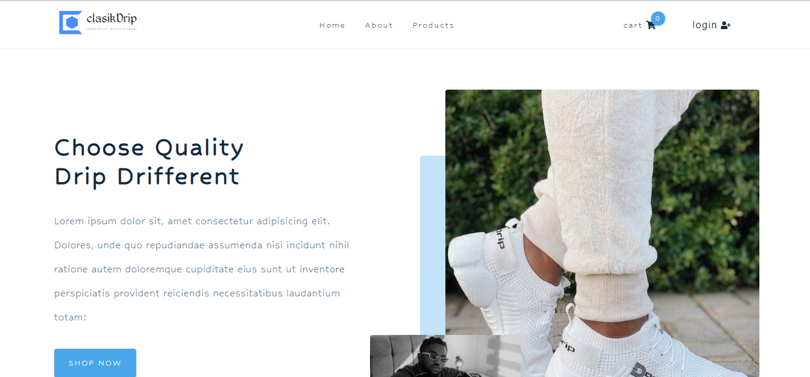

## Table of contents

- [Overview](#overview)
  - [Screenshot](#screenshot)
  - [Links](#links)
- [My process](#my-process)
  - [Built with](#built-with)
  - [HOW TO RUN](#useful-resources)

## Overview

An e-commerce site for cloths and accessories

### Screenshot

### Links

- Live Site URL: [live](https://clasikdrip.com/)

## My process

### Built with

- Semantic HTML5 markup
- CSS custom properties
- Flexbox
- CSS Grid
- Mobile-first workflow
- [React](https://reactjs.org/) - JS library
- [Styled Components](https://styled-components.com/) - For styles
- strapi Cms
- auth0
- react paystack
- react icons

## HOW TO RUN

Clone repo then npm install
